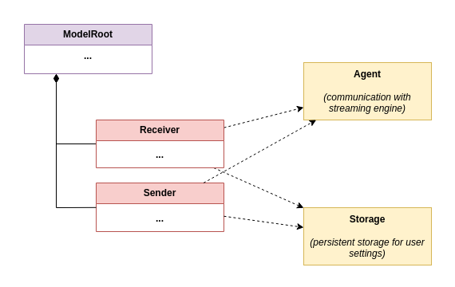

# Model

## Model tree

Models are arranged into a tree, starting with [ModelRoot](https://github.com/roc-streaming/roc-droid/tree/main/lib/src/model/model_root.dart) class.

Currently there are two model classes:

* [Sender](https://github.com/roc-streaming/roc-droid/tree/main/lib/src/model/sender.dart) - captures local audio device or sound played by local apps, and streams it to remote peer

* [Receiver](https://github.com/roc-streaming/roc-droid/tree/main/lib/src/model/receiver.dart) - receives stream from remote peer and plays to local audio device

Models don't actually work with the audio, they only provide abstraction for UI to manipulate corresponding functions of [Agent](https://github.com/roc-streaming/roc-droid/tree/main/lib/src/agent/agent.dart) (which interacts with the streaming engine).

Models also interact with [Storage](https://github.com/roc-streaming/roc-droid/tree/main/lib/src/storage/storage.dart) to save configuration persistently and restore at start.

## MobX

Models are implemented with [mobx](https://pub.dev/packages/mobx) reactive framework.

Model classes fields are *observable*: when they're modified, affected parts of the widget tree are automatically rebuilt.

These classes follow a few simple rules:

* model classes should derive from mobx `Store`
* state that affects UI (private or public) should be annotated with `@observable`
* methods or getters which result depend on that state should be annotated with `@computed`
* methods that mutate that state should be annotated with `@action`

The UI code, in turn, should wrap sub-trees to be automatically rebuilt with mobx `Observer`.

Please consult `mobx` documentation for further details.

## Model vs. DTO

In our code base, a `model` is an active (reactive) object that abstracts some part of the system for the UI. It has state and it communicates with the real world (e.g. with the streaming engine).

We also have `dto` package, which contains common *data transfer objects* - plain data types without any behavior. These DTOs are widely used in the code: for example, `SenderConfig` is used by `Sender` model (in private fields), `Storage` (to read/write config), and `Agent` (to enable streaming).

Usually DTOs are immutable objects and models store them as a private `@observable` field updated atomically. When the model needs to update the field, it should replace the whole DTO with an updated one.
