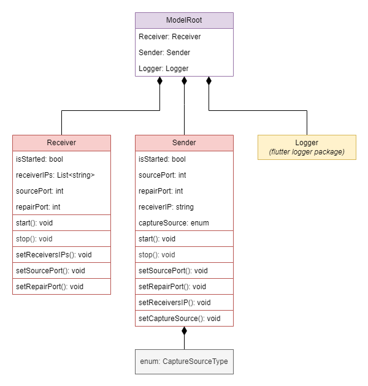

# Model

## Model tree

The roc-droid `Model` module is responsible for managing the data model of the application's graphical interface. Data changes in the model are initiated by the `Agent` module and then utilized by the `UI` module.

Description of the model tree:

* The roc-droid client application's model is based on the `ModelRoot` class, highlighted in violet.
  
  * Class implementation: [ModelRoot](https://github.com/roc-streaming/roc-droid/tree/main/lib/src/model/model_root.dart)

* The `ModelRoot` class itself is derived from two base classes: `Receiver` and `Sender`, both highlighted in red.

  * The red classes contain `@observable`, `@computed` fields and `@action` methods provided in the `Mobx` package.

  * Receiver implementation: [Receiver](https://github.com/roc-streaming/roc-droid/tree/main/lib/src/model/receiver.dart)

    * The Receiver has its own automatically generated code for the correct operation of `Mobx`: [receiver.g.dart](https://github.com/roc-streaming/roc-droid/tree/main/lib/src/model/receiver.g.dart)

  * Sender implementation: [Sender](https://github.com/roc-streaming/roc-droid/tree/main/lib/src/model/sender.dart)

    * The Sender has its own automatically generated code for the correct operation of `Mobx`: [sender.g.dart](https://github.com/roc-streaming/roc-droid/tree/main/lib/src/model/sender.g.dart)

* The `Logger` class is managed by the Flutter `logger` package and is highlighted in yellow.

* The `CaptureSourceType` enumerator control the type of capture source and is colored gray.

  * enum implementation: [CaptureSourceType](https://github.com/roc-streaming/roc-droid/tree/main/lib/src/model/capture_source_type.dart)
