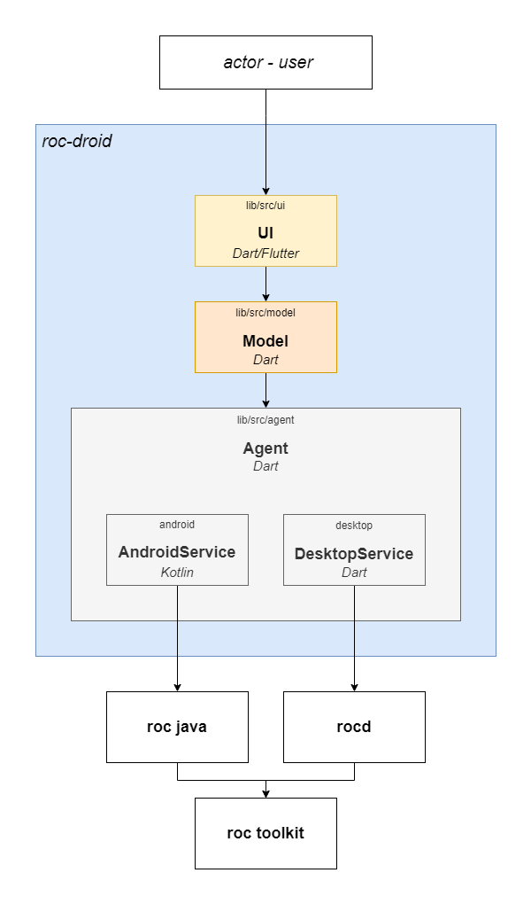

# Overview

roc-droid is responsible for implementing and managing the functionality of the roc-toolkit logic in the form of an application.

The roc-droid implementation is comprised of three modules:

* [**UI**](./ui.md) – (`lib/src/ui`): This module is responsible for rendering the user interface and handling user interactions with the application functionality.

* [**Model**](./model.md) – (`lib/src/model`): This module contains all the primary classes and entities necessary for updating the visual display of the graphical interface.

* [**Agent**](./agent.md) – (`lib/src/agent`): This module manages client interaction with the core logic of the roc-toolkit.
