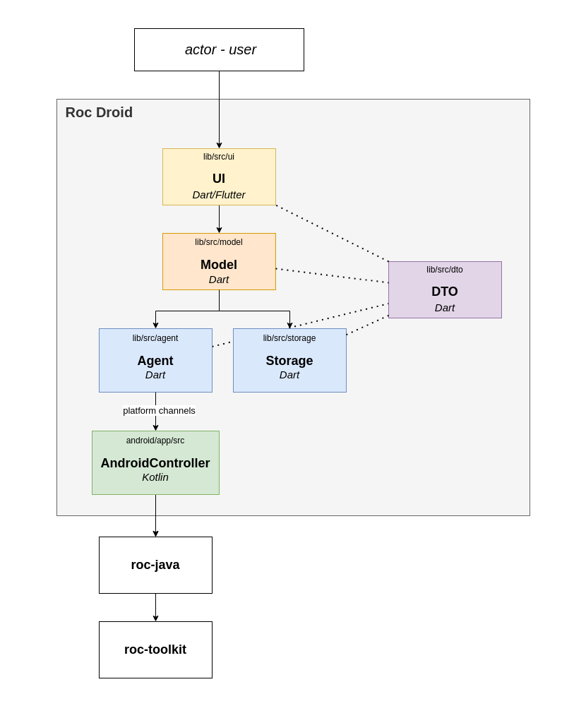

# Overview

{ width="550px" }

The roc-droid implementation is comprised of several modules:

* [**UI**](./ui.md) – (`lib/src/ui`): Renders model to the user and allows the user to interact with it.

* [**Model**](./model.md) – (`lib/src/model`): Contains data model of the application's graphical interface. Ties agent and storage together and hides them from UI.

* **Agent** – (`lib/src/agent`): Implements interaction with the streaming engine.

* **Storage** – (`lib/src/storage`): Implements persistent storage for user settings.

* **DTO** – (`lib/src/storage`): Defines data transfer objects - simple types with no behavior reused across other packages.

* **Android Service** – (`android/app/src`): Implements Android Foreground Service with audio I/O and streaming. Built in Kotlin using [Roc Toolkit](https://github.com/roc-streaming/roc-toolkit/) (via [roc-java](https://github.com/roc-streaming/roc-java)).
