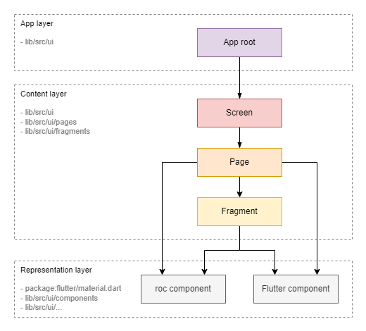
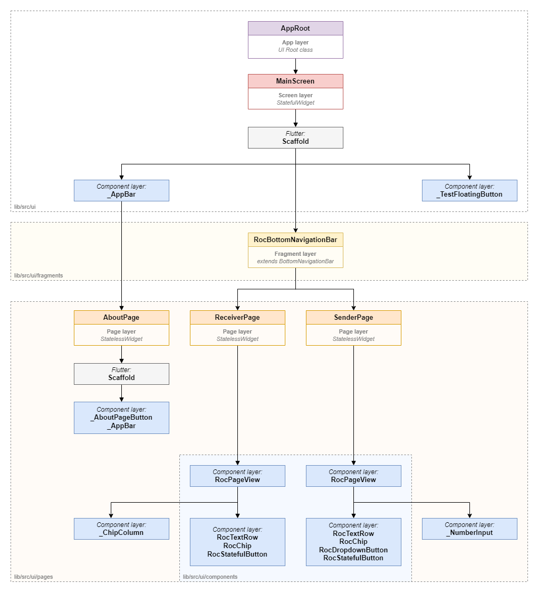

# User interface

## Widget types

Widgets can be categorized into the following types:

* **Content Layer**

    Widgets at this level define the application's structure (layout) and the binding of the content (models) to the representation (components from the representation layer). These widgets actively interact with the model layer using the Observer pattern.

    Sublevels:

    * `Screen`: This widget corresponds to the entire screen.
    
    * `Page`: This widget represents a page within the screen. Switching between pages is done via the lower tab bar or AppBar.
    
    * `Fragment`: This widget represents a smaller fragment of the UI, such as a separate block or item in a list.

* **Representation Layer**

    Widgets at this level, known as components, are the building blocks of the UI. A component defines its appearance and user interaction but is not tied to specific content (model).

    Sublevels:

    * `roc Component`: Custom components that can implement application-specific styles or interface elements.
    
    * `Flutter Component`: Standard components from the Flutter SDK.
    
    Fragment vs. Component
    
    It's important to understand the difference between a fragment and a component:

    * `Fragment`: Responsible for communication with specific data (models or defined data). However, it is not responsible for a specific representation; this task is delegated to the components.
    
    * `Component`: Not tied to specific data—it receives data from above and does not interact with models. It is responsible for implementing a specific representation, such as styles and responses to clicks.
    
    > **Note:** In our code, custom component classes are prefixed with `roc` to distinguish them from standard components or created as private widgets inside of a parent classes starting with `_` and without `roc`. Other types of widgets do not have a special prefix.

    > **Note:** In some frameworks, an entity similar to a fragment is called a `widget`. We use the term `fragment` for clarity (like in Android SDK).

## Widget tree

The UI diagram of the Rock Droid application client illustrates a tree of widgets that form the visual presentation for the user.

Designations:

* **Purple:** Root class of the UI application (`Content Layer`)

  * roc-droid classes:

    * [AppRoot](https://github.com/roc-streaming/roc-droid/tree/main/lib/src/ui/app_root.dart)

* **Red:** Screen-level widgets (`Content Layer`)

  * roc-droid classes:

    * [MainScreen](https://github.com/roc-streaming/roc-droid/tree/main/lib/src/ui/main_screen.dart)

* **Orange:** Page-level widgets (`Content Layer`)

  * roc-droid classes:

    * [ReceiverPage](https://github.com/roc-streaming/roc-droid/tree/main/lib/src/ui/pages/receiver_page.dart)
  
    * [SenderPage](https://github.com/roc-streaming/roc-droid/tree/main/lib/src/ui/pages/sender_page.dart)
  
    * [AboutPage](https://github.com/roc-streaming/roc-droid/tree/main/lib/src/ui/pages/about_page.dart)

* **Yellow:** Fragment-level widgets (`Content Layer`)

  * roc-droid classes:

    * [RocBottomNavigationBar](https://github.com/roc-streaming/roc-droid/tree/main/lib/src/ui/fragments/roc_bottom_navigation_bar.dart)

* **Gray:** Native Flutter `Widget` class (`Representation Layer`)

* **Blue:** Custom Roc `Widget` class (`Representation Layer`)
  
    * Location: `/lib/src/ui/components`
  
    * Functionality:

      * Representing Widgets that provide certain data to the user.

        * [RocChip](https://github.com/roc-streaming/roc-droid/tree/main/lib/src/ui/components/roc_chip.dart)

        * [RocTextRow](https://github.com/roc-streaming/roc-droid/tree/main/lib/src/ui/components/roc_text_row.dart)
  
      * Representing Widgets that provide the user with the ability to enter certain data.

        * [RocDropdownButton](https://github.com/roc-streaming/roc-droid/tree/main/lib/src/ui/components/roc_dropdown_button.dart)

        * [RocStatefulButton](https://github.com/roc-streaming/roc-droid/tree/main/lib/src/ui/components/roc_stateful_button.dart)
  
      * Representing Widgets that control specific view representations.

        * [RocPageView](https://github.com/roc-streaming/roc-droid/tree/main/lib/src/ui/components/roc_page_view.dart)

        * [RocScrollView](https://github.com/roc-streaming/roc-droid/tree/main/lib/src/ui/components/roc_scroll_view.dart)
